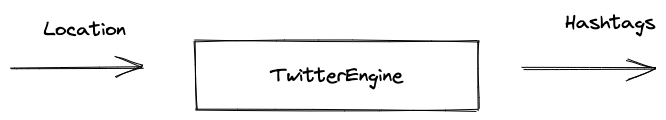
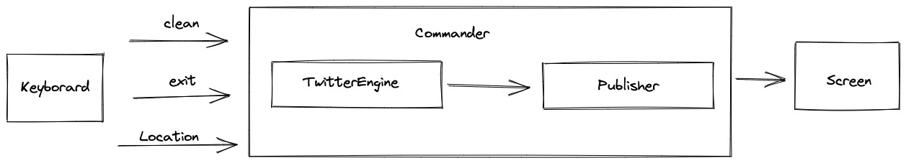

# Trendings

Simple application developed for educational purposes. This app was presented in my 
first presentation for the group Women Who Code Chile https://www.linkedin.com/company/women-who-code-santiago/

## Goal

Publish trending topics based on locations using https://trends24.in as a data source.

## Components

### TwitterEngine

Responsible for receive locations and make the request (scrapping) Trends24 site.

### Commander

Receive command from `os.Stdin` and uses `TwitterEngine` to look for trends.

### Publisher

Receive messages from the commander and saves them into the local database (`sync.Map`).

